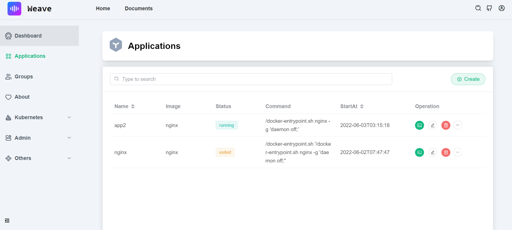

# Weave

[](https://github.com/qingwave/weave/actions?query=workflow%3Aweave)
[](https://goreportcard.com/report/github.com/qingwave/weave)
[](https://codecov.io/gh/qingwave/weave)
[](https://github.com/qingwave/weave/blob/master/LICENSE)


---

> English | [中文](README_zh.md)

Weave is a Go + Vue3 application starter, simple but functional, supported by gin, gorm, redis, postgres, vue, element-plus, websocket and much more.

<table>
  <tr>
     <td width="50%" align="center"><b>Login</b></td>
     <td width="50%" align="center"><b>Home</b></td>
  </tr>
  <tr>
     <td></td>
     <td></td>
  </tr>
  <tr>
      <td width="50%" align="center"><b>Dashboard</b></td>
      <td width="50%" align="center"><b>App</b></td>
  </tr>
  <tr>
     <td></td>
     <td></td>
  </tr>
  <tr>
      <td width="50%" align="center"><b>Web Shell</b></td>
      <td width="50%" align="center"><b>Web Code Editor</b></td>
  </tr>
  <tr>
     <td></td>
     <td></td>
  </tr>
</table>

## Features
Server support features:
- Restful api, write by gin
- MVC structure
- Postgres storage, via gorm
- Swagger doc, support by swag
- Structured log, support by logrus
- Prometheus monitor
- PProf debug
- Graceful shutdown
- Authentication, support jwt
- Request rate limit, server level or user ip
- OAuth Login and store hashed password
- Redis cache
- RBAC supported
- Container application management, support docker and kubernetes
- Post management

Frontend support features:
- Vue3 supported
- UI with element-plus
- Build with vite
- Charts integration, support by echarts
- WebShell supported
- Windi CSS
- OAuth Login
- Web code editor, support by codemirror
- MarkDown preview and editor

TODOs
- [x] Redis cache
- [x] Request rate limit
- [x] Authentication
- [x] WebSocket
- [x] Trace
- [x] UI
- [x] WebShell
- [ ] Dark theme
- [ ] Mobile UI 
## Get started
Before starting, you should already install [golang](https://go.dev/), [docker](https://docs.docker.com/engine/install/) and [nodejs](https://nodejs.org/en/download/) in your develop env.
### Run server

Env:
- golang (1.18 or later)

Install dependencies, postgresql, redis, swag 
```bash
make init
```

run locally
```bash
make run
```

run server in docker
```bash
# build image
make docker-build-server
# run server
make docker-run-server
```

> For Windows, you can run script in [Makefile](./Makefile) manually

### Test api
See more api in http://localhost:8080/index
See swagger http://localhost:8080/swagger/index.html#/

Register user
```bash
curl -XPOST http://localhost:8080/api/v1/auth/user -d '{"name": "zhang3", "email": "zhang3@t.com","password": "123456"}'
```

Login, get jwt token
> Only admin user can access any apis, other user need create RBAC policy
```bash
curl -XPOST http://localhost:8080/api/v1/auth/token -d '{"name": "admin", "password": "123456"}'
```
Response as follows, set token in `Authorization` Header
```json
{
  "code": 200,
  "msg": "success",
  "data": {
    "token": "xxx",
    "describe": "set token in Authorization Header, [Authorization: Bearer {token}]"
  }
}
```

Get users
```bash
token=xxx
curl -X 'GET' 'http://localhost:8080/api/v1/users' -H "Authorization: Bearer $token"
```

### Run UI
Assume you have installed `Nodejs`, if not, install it by [nvm](https://github.com/nvm-sh/nvm#install--update-script)

If your frontend deploy in the remote, please change `server.host` and `server.https` in [vite.config.js](./web/vite.config.js).

Run ui with command `make ui` or
```bash
cd web
npm i
npm run dev 
```

Default admin user `admin/123456`
or demo user `demo/123456`

> Only admin user can access all api, other user must config RBAC at first

Explore in http://127.0.0.1:8081

run frontend in docker
```bash
# build image
make docker-build-ui
# run frontend
make docker-run-ui
```

More ui in [img](./document/img/)

- Login page


- Dashboard page


- App page


- Webshell page


- Blog list


- Article


### Documents
- [Contributing](./CONTRIBUTING.md), contributing details
- [Config](./config/app.yaml), your can enable docker/kubernetes in config
- [OAuth](./document/oauth.md)
- [RBAC](./document/authentication.md)
