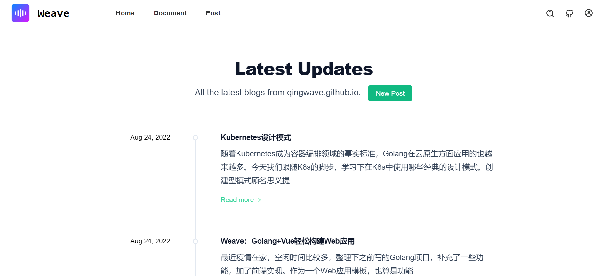

# Weave

[](https://github.com/qingwave/weave/actions?query=workflow%3Aweave)
[](https://goreportcard.com/report/github.com/qingwave/weave)
[](https://codecov.io/gh/qingwave/weave)
[](https://github.com/qingwave/weave/blob/master/LICENSE)

Simple but functional Go+Vue application starter, supported by gin, gorm, redis, postgres, vue, element-plus, websocket and much more.

<table>
  <tr>
     <td width="50%" align="center"><b>Login</b></td>
     <td width="50%" align="center"><b>Home</b></td>
  </tr>
  <tr>
     <td></td>
     <td></td>
  </tr>
  <tr>
      <td width="50%" align="center"><b>Dashboard</b></td>
      <td width="50%" align="center"><b>App</b></td>
  </tr>
  <tr>
     <td></td>
     <td></td>
  </tr>
  <tr>
      <td width="50%" align="center"><b>Web Shell</b></td>
      <td width="50%" align="center"><b>Web Code Editor</b></td>
  </tr>
  <tr>
     <td></td>
     <td></td>
  </tr>
</table>

## Features
Server support features:
- Restful api, write by gin
- MVC structure
- Postgres storage, via gorm
- Swagger doc, support by swag
- Structured log, support by logrus
- Prometheus monitor
- PProf debug
- Graceful shutdown
- Authentication, support jwt
- Request rate limit, server level or user ip
- Redis cache
- RBAC supported
- Container application management, support docker and kubernetes
- Post management

Frontend support features:
- Vue3 supported
- UI with element-plus
- Build with vite
- Charts integration, support by echarts
- WebShell supported
- Windi CSS
- OAuth Login
- Web code editor, support by codemirror
- MarkDown preview and editor

TODOs
- [x] Redis cache
- [x] Request rate limit
- [x] Authentication
- [x] WebSocket
- [x] Trace
- [x] UI
- [x] WebShell
- [ ] Dark theme
- [ ] Mobile UI 
## Get started
Before starting, you should already install [golang](https://go.dev/), [docker](https://docs.docker.com/engine/install/) and [nodejs](https://nodejs.org/en/download/) in your develop env.
### Run server

Env:
- golang (1.18 or later)

Install dependencies, postgresql, redis, swag 
```bash
make init
```

run locally
```bash
make run
```

> For Windows, you can run script in [Makefile](./Makefile) manually

See http://localhost:8080

### Test api
See more in swagger http://localhost:8080/swagger/index.html#/

Register user
```bash
curl -XPOST http://localhost:8080/api/v1/auth/user -d '{"name": "zhang3", "email": "zhang3@t.com","password": "123456"}'
```

Login, get jwt token
> Only admin user can access any apis, other user need create RBAC policy
```bash
curl -XPOST http://localhost:8080/api/v1/auth/token -d '{"name": "admin", "password": "123456"}'
```
Response as follows, set token in `Authorization` Header
```json
{
  "code": 200,
  "msg": "success",
  "data": {
    "token": "xxx",
    "describe": "set token in Authorization Header, [Authorization: Bearer {token}]"
  }
}
```

Get users
```bash
token=xxx
curl -X 'GET' 'http://localhost:8080/api/v1/users' -H "Authorization: Bearer $token"
```

Container web shell
1. login in swagger `http://localhost:8080/swagger/index.html#/auth/post_login`
2. create container `http://localhost:8080/swagger/index.html#/user/post_api_v1_users`
```json
{
  "cmd": [
    "top"
  ],
  "image": "alpine",
  "name": "myapp"
}
```
3. open cloudshell `http://localhost:8080/api/v1/containers/{:containerid}/terminal`

### Run UI
Assume you have installed `Nodejs`, if not, install it by [nvm](https://github.com/nvm-sh/nvm#install--update-script)

```bash
cd web
npm i
npm run dev 
```

Default admin user `admin/123456`
or demo user `demo/123456`

Explore in http://127.0.0.1:8081

More ui in [img](./document/img/)

Login page


Dashboard page


App page


Webshell page


Blog list


Article


### Documents
- [Config](./config/app.yaml), your can enable docker/kubernetes in config
- [OAuth](./document/oauth.md)
- [RBAC](./document/authentication.md)
