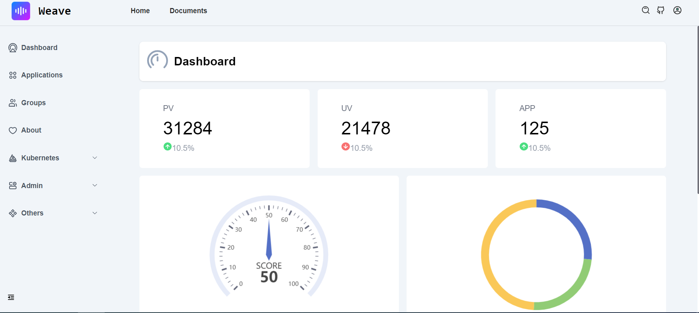
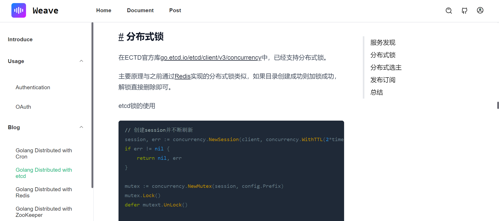

# Weave

[](https://github.com/qingwave/weave/actions?query=workflow%3Aweave)
[](https://goreportcard.com/report/github.com/qingwave/weave)
[](https://codecov.io/gh/qingwave/weave)
[](https://github.com/qingwave/weave/blob/master/LICENSE)


---

> [English](README.md) | 中文

Weave是一个基于Go + Vue3实现的Web应用模板，支持前后端，拥有完整的认证、存储、Restful API、应用管理（docker & kubernetes）功能，主要技术栈包括Go、Vue3、Gin、gorm、redis、postgres、ElementPlus、vite、websocket、kuberentes等。

<table>
  <tr>
     <td width="50%" align="center"><b>Login</b></td>
     <td width="50%" align="center"><b>Home</b></td>
  </tr>
  <tr>
     <td></td>
     <td></td>
  </tr>
  <tr>
      <td width="50%" align="center"><b>Dashboard</b></td>
      <td width="50%" align="center"><b>App</b></td>
  </tr>
  <tr>
     <td></td>
     <td></td>
  </tr>
  <tr>
      <td width="50%" align="center"><b>Web Shell</b></td>
      <td width="50%" align="center"><b>Web Code Editor</b></td>
  </tr>
  <tr>
     <td></td>
     <td></td>
  </tr>
</table>

## 功能
后端支持的功能包括:
- Restful API，通过Gin实现
- MVC架构
- Postgres存储，通过gorm
- Swagger文档支持
- 结构化日志，由logrus实现
- Prometheus及监控
- 支持PProf性能分析
- 优雅中止服务
- JWT认证
- 服务限流，支持Server级、IP或者User
- 支持OAuth登录(Github等)，密码加密保存
- Redis缓存
- RBAC授权策略
- 容器应用管理，支持docker与kubernetes
- 博客管理

前端支持的功能包括:
- Vue3开发，使用组合式API
- Element-plus框架
- 使用vite快速编译
- 图标功能, 集成echarts
- WebShell支持
- Windi CSS，原子化CSS
- OAuth登录
- Web编辑器, 集成codemirror
- MarkDown预览与编辑

## 快速开始

开始之前，确保安装了基础环境[golang](https://go.dev/), [docker](https://docs.docker.com/engine/install/) 与 [nodejs](https://nodejs.org/en/download/)。

### 运行后端服务

环境:
- golang (1.18之后)

安装依赖 postgresql, redis, swag 
```bash
make init
```

本地运行服务
```bash
make run
```

> 对于Windows环境, 需要手动执行[Makefile](./Makefile)中的脚本

容器中运行
```bash
# build image
make docker-build-server
# run server
make docker-run-server
```

### 测试API
查看所有API http://localhost:8080/index
查看Swagger http://localhost:8080/swagger/index.html#/

注册用户
```bash
curl -XPOST http://localhost:8080/api/v1/auth/user -d '{"name": "zhang3", "email": "zhang3@t.com","password": "123456"}'
```

获取jwt令牌
> 初始状态只有admin用户可以访问所有接口, 其他用户必须创建RBAC规则
```bash
curl -XPOST http://localhost:8080/api/v1/auth/token -d '{"name": "admin", "password": "123456"}'
```
返回如下, 将token添加到HTTP `Authorization` Header中
```json
{
  "code": 200,
  "msg": "success",
  "data": {
    "token": "xxx",
    "describe": "set token in Authorization Header, [Authorization: Bearer {token}]"
  }
}
```

获取所有用户接口
```bash
token=xxx # 上个步骤中获取的token
curl -X 'GET' 'http://localhost:8080/api/v1/users' -H "Authorization: Bearer $token"
```

### 运行前端

安装`Nodejs`(>=v16), 建议通过[nvm](https://github.com/nvm-sh/nvm#install--update-script)

如果前端不在本地部署, 需要改动[vite.config.js](./web/vite.config.js)中的`server.host`与`server.https`，本项目中涉及后端设置Cookie，必须开启Https。

运行前端
```bash
cd web
npm i
npm run dev 
```

默认admin用户/密码：`admin/123456`
demo用户 `demo/123456`

在Docker中运行
```bash
# build image
make docker-build-ui
# run frontend
make docker-run-ui
```

> 初始状态只有admin用户可以访问所有接口, 其他用户必须创建RBAC规则

打开 http://127.0.0.1:8081

更多界面参考 [img](./document/img/)

- 登录页面


- 仪表盘


- 应用页面


- Webshell页面


- 文章列表


- 文章详情


### 文档
- [Config](./config/app.yaml), 配置对应功能是否开启
- [OAuth](./document/oauth.md)
- [RBAC](./document/authentication.md)
